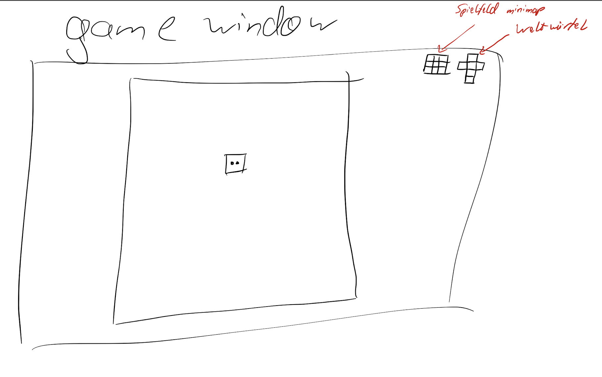
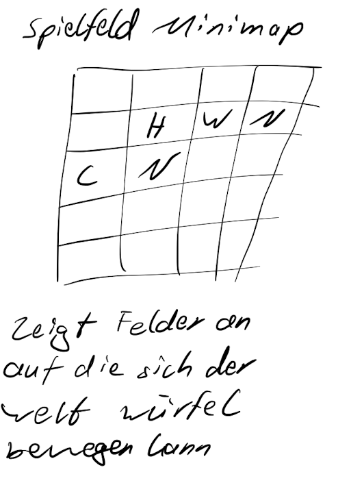
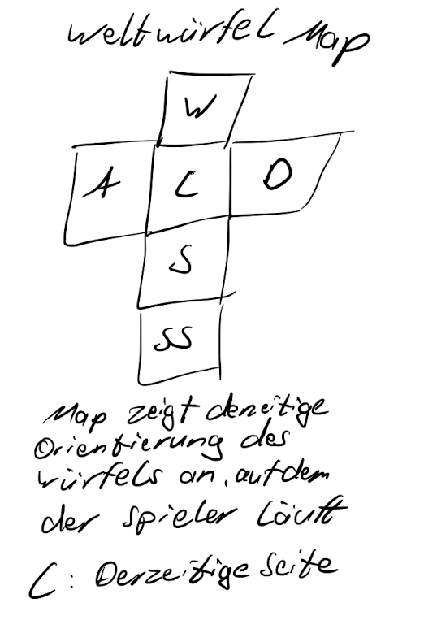
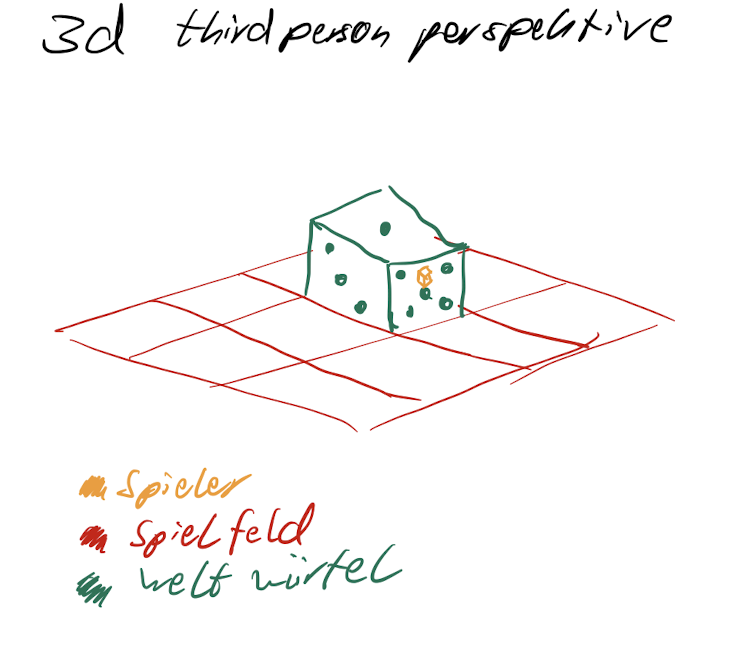

# Cube Puzzle Game

-   side 2d
-   minimap(s) oben rechts
-   spieler ist würfel
-   spielwelt ist ein würfel
-   welt-würfel bewegt sich auf einem spielfeld mit verschiedenen Effekten
-   bewegt sich der spieler über die kanten des Spielfelds bewegt sich der Welt Würfel mit

## Game Window

## Board minimap

## World Dice minimap

## 3D Perspektive für verständlichkeit

